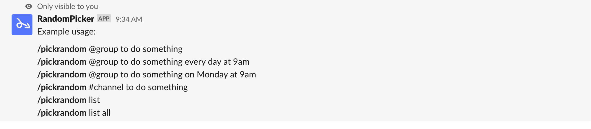

[](https://coveralls.io/github/m-vdb/slack-randompicker?branch=master)

# slack-randompicker
Pick a random person from a group or channel in Slack

## Usage

To show the help, you can type `/pickrandom help` in Slack:



Here is the output of an instantaneous random pick, using `/pickrandom #general to play music`:


And an example of a periodic random pick, using `/pickrandom #general to prepare slides every Monday at 10am`:


To dispay all the current scheduled random picks, you can do `/pickrandom list`:


## Server installation

After creatinga Slack bot, you can install `slack-randompicker` using `docker` on your own server:

```bash
$ export DATABASE_URL=...
$ export SLACK_TOKEN=...
$ export SLACK_SIGNING_SECRET=...
$ docker run -e DATABASE_URL -e SLACK_TOKEN -e SLACK_SIGNING_SECRET -p 8000:8000 mvdb/slack-randompicker:0.2.0
```

## Slack app setup

Assuming your Slackbot is installed at `https://host.com`, to setup the bot for your own workspace, you will need the following:

- *Interactivity*: set the request URL to `https://host.com/actions`
- *Slash commands*: create a new slash command named `/pickrandom` and set the request URL to `https://host.com/slashcommand`
- *Bot Token Scopes*: set up the scopes `channels:read`, `chat:write`, `chat:write.public`, `commands`, `groups:read`, `usergroups:read` and `users:read`.
